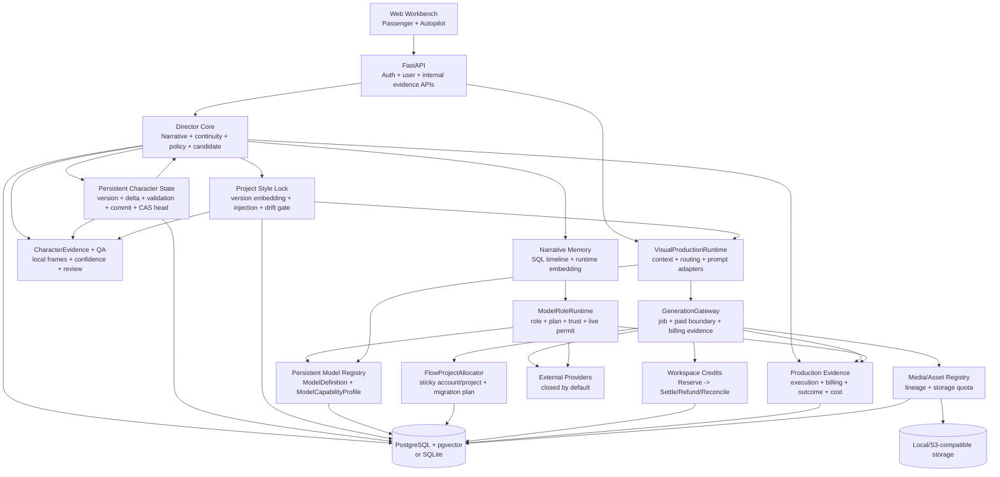
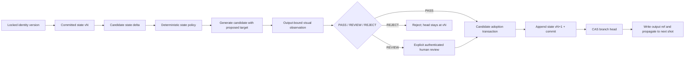

# AI Director Platform — Current Architecture

Snapshot date: 2026-08-23
Repository: `ai-director-platform`
Branch: `main`
Commit: `ea9d042` (working tree clean; no remote)
Offline algorithm baseline: commit `0a74d31`, tag `v0.2.0-algorithm-core-offline`
Phase III implementation: commit `99f9c60`, evidence tag `v0.3.0-production-evidence-core-offline`
Migration head: `0037_direct_uploads`
Release posture: **NOT PRODUCTION-READY**

This document describes the Phase III evidence checkpoint plus the current 2026-08-22 persistent-character-state
development checkpoint. The offline baseline was frozen after the historical `348 passed, 39 warnings` gate. The tagged
Phase III checkpoint passed `406 passed, 57 warnings in 71.58s`, Mypy over 121 source files, Ruff lint, Ruff format
(226 files), Node syntax and `git diff --check`. Those numbers are historical tag evidence, not a test count for every
later working-tree edit. The current working tree passes `610 passed, 2 skipped, 61 warnings`, Ruff check,
Mypy over 133 source files, Web production build and npm audit; the two skipped are opt-in live image tests. The checkpoint remains offline evidence rather than a production
release; no real Provider or chain call was executed, and this checkpoint adds no visual-generation Provider.

## Truth labels

| Label | Meaning |
| --- | --- |
| Frozen baseline | Present at commit `0a74d31` and recoverable from tag `v0.2.0-algorithm-core-offline` |
| Checkpoint implemented | Code and offline tests exist in the committed Phase III evidence checkpoint |
| Fixture evidence | Real local bytes/SQL/service flow were exercised with self-generated or deterministic test inputs |
| Live verified | A real external Provider call and its result/billing evidence were recorded |
| Not implemented | No complete current path exists |

There is **no Live verified Provider row in this snapshot**. Adapter, payload, Mock transport and fixture evidence
must not be relabeled as live proof.

## System shape

The product is a Python 3.12 modular monolith with a static responsive Web application, FastAPI control/data plane,
a durable generation worker and a Chrome extension/browser worker for explicitly authorized Google Flow sessions.
PostgreSQL + pgvector is the production database; SQLite remains a local/test compatibility target. Media uses
local or S3-compatible storage.



Passenger and Autopilot share `VisualProductionRuntime`, `GenerationGateway`, `MediaRegistry`, storage, routing,
provider execution and accounting. A second generation engine or wallet is not allowed.

## Repository layers

| Layer | Principal paths | Current status |
| --- | --- | --- |
| Web | `apps/web/` | WIP implemented; cookie/CSRF client path and 4-second starter default connected |
| API | `apps/api/video_platform_api/` | WIP implemented; auth/quota/canary/evidence routes added |
| Browser worker | `apps/browser-worker-extension/`, `services/browser-runtime/` | Frozen baseline; no current Flow live validation |
| Domain/contracts | `packages/domain/`, `packages/contracts/` | WIP through migration `0033`; DePay checkout sessions, callback receipts and payment-ledger rows are schema-backed |
| Payments | `core/payments/`, `apps/web/wallet.js` | DePay shared-link QR checkout, signed callback posting and authenticated Alchemy purchase/reorg reconciliation are implemented offline; real payment is not yet executed |
| Model infrastructure | `core/model-registry/`, `core/entitlements/`, `config/model-registry/` | Persistent single capability truth and role runtime |
| Director/QA/cost | `core/character/`, `core/style/`, `core/narrative/`, `core/continuity/`, `core/generation-policy/`, `core/qa/`, `core/cost/`, `core/production/` | WIP implemented with offline evidence tests, including persistent state and locked-style generation/commit gates |
| Generation/media | `services/generation-gateway/`, `services/media-service/`, `services/production-engine/` | Durable paid boundary, billing evidence, Flow affinity and storage quota |
| Providers | `providers/` | Mixed adapter/stub state; none live-verified in Phase III |
| Skills | `skills/`, `core/skills/` | Shared filesystem Registry and content-hash versions implemented; all twelve Skill bodies rewritten against the current contracts, none yet executed by a model |

## Unified Prompt and Skill boundary

The current working tree has one Prompt Compiler implementation and one filesystem-authoritative Skill Registry:

```text
CanonicalShotSpec
-> PromptCompilerInput { shot_spec, asset_bindings, continuity_context }
-> PromptCompilerService + SkillRegistry.resolve("prompt-compiler")
-> PromptCompilerOutput (exactly eight fields)
-> Model Router -> Video Adapter
-> GenerationRequest.provider_payload
-> GenerationGateway asset resolution
-> Provider adapter
```

`core/skills/skill_core/compiler.py` is only a compatibility import and `VideoShotPromptCompiler` is only an alias;
neither is a second implementation. The Container constructs a single `prompts` service. Skill versions are derived
from the SHA-256 hash of the complete `SKILL.md`, and PromptCompilation records the resolved hash plus typed input and
output. The database `Skill`/`SkillVersion` models are not synchronized or consumed and must not be treated as a second
active registry.

Prompt compilation is still deterministic. `skill_contract()` exposes the installed Skill text and JSON Schemas
but does not invoke `ModelRoleRuntime`, so no Skill body currently reaches a model. All twelve bodies were
rewritten on 2026-08-22 against the contracts in force: the installed `prompt-compiler` Skill now describes the
`PromptCompilerInput` envelope, the real `CanonicalShotSpec` field names, the eight `PromptCompilerOutput` fields
and the `COMPILED`/`NOT_COMPILABLE` invariants, and it emits no Provider or model selection.
`scripts/review_skill_contract.py` checks a candidate against those criteria without installing anything, and
`tests/test_installed_skills.py` keeps the structural invariants green. Enabling model-backed compilation
remains a separate, undecided step: it requires an explicit product decision on fallback behaviour, recorded in
`HANDOFF.md` section 8.

## Product entry modes and accounting

Passenger path:

```text
authenticated request
-> server-owned plan/role/capability resolution
-> server pricing and trust/criticality gates
-> atomic Job + credit reservation + CostRecord + idempotency
-> shared Visual Runtime and GenerationGateway
-> Provider boundary (Mock by default; live also requires a permit)
-> completion/billing evidence/media
-> settle, refund or reconcile
```

When Passenger video duration is omitted it defaults to 4 seconds. Under the current Seedance pricing snapshot this
is about 44 credits, allowing one request against the 50-credit starter grant. An explicit 8-second request remains
about 87 credits and fails before Job/Provider creation if the balance cannot be reserved. Fixed-offer purchases are
implemented; recurring grants, expiry and administrator adjustments are not.

The workspace wallet is authoritative only for user credits:

```text
RESERVED --completed--> SETTLED
RESERVED --proven pre-submit terminal--> REFUNDED
RESERVED --paid result uncertain--> RECONCILIATION_REQUIRED
RECONCILIATION_REQUIRED --evidence decision--> SETTLED | REFUNDED
```

Workspace credits, generation supplier USD/credit evidence, Flow account credits and RunAPI's edge budget are
separate accounting domains.

Base Native USDC purchases form another explicit evidence domain. One reusable DePay Payment Link is fixed at 30
Native USDC with quantity disabled. Every authenticated click creates a separate `OnchainPaymentIntent` for 3,000
credits, plus a hashed checkout token, and injects both `order_ref` and the opaque token into the shared link. A DePay
callback must pass RSA-PSS verification over the raw body and match the PaymentIntent, configured link ID, Base
network, Circle Native USDC contract, treasury address and exact 30 USDC. The same transaction then changes a FREE
workspace to PRO when needed and appends 3,000 credits; an existing PRO workspace receives only the credits. Business
entitlements come from the PaymentIntent snapshot, not an amount-to-credit calculation. There is no subscription,
renewal, user-wallet binding or per-order unique amount. Alchemy remains an independent authenticated chain observer:
it attaches canonical log evidence and can post append-only reorg reversal entries when the available balance permits;
otherwise the payment becomes `RECONCILIATION_REQUIRED`. Real-wallet payment evidence remains outside this checkpoint.

## Authentication, tenancy and storage

Authentication provides email/password registration and login, PBKDF2-SHA256 password hashing, hashed durable
sessions, workspace roles and project/asset/job tenant isolation. Phase III adds:

- HttpOnly session cookies;
- `Secure` cookies in production and `SameSite=Lax`;
- double-submit CSRF for unsafe cookie-authenticated requests, while scoped Bearer/internal callers remain
  supported;
- persistent login throttles;
- expiring, hashed, one-use password-reset tokens; successful reset revokes active sessions;
- Web `credentials: include` and CSRF headers, with no session token in `sessionStorage`.

Workspace storage keeps `max_storage_bytes`, `used_storage_bytes` and `reserved_storage_bytes`. Upload admission
reserves bytes atomically; successful registration settles the reservation, proven failure releases it and an
uncertain post-registration failure keeps a hold for reconciliation. `MediaAsset.size_bytes` records actual bytes.

Email verification, MFA, member invitations/removal, device-session operations and a complete security-event
program remain production blockers.

## Narrative, timeline and committed-state safety

The deterministic Narrative Compiler still produces the SQL story graph and planned state. It does not require a
Provider call. External model reasoning is used only where a current business caller explicitly requests it
through `ModelRoleRuntime`.

`TimelineState` remains authoritative. `AuthoritativeTimelineStateEngine` v3 uses a relational
`TimelineTransition` for:

```text
CONTINUOUS, SCENE_CUT, TIME_JUMP, FLASHBACK, FLASH_FORWARD,
MONTAGE, DREAM, LOCATION_CHANGE, EXPLICIT_RESET
```

`CONTINUOUS` can propagate committed character/prop/costume state. Scene/location boundaries reset spatial state.
Time jumps, flash-forward and montage require reconciliation. Flashback/flash-forward/dream create branch keys.
Legacy string hints are converted to a row instead of remaining an alternate source of truth.

Editing an earlier committed-state input marks later shots `downstream_state_stale` with `RECOMPUTE_REQUIRED`.
Planning-only recompute stops at active/committed shots and never mutates committed media. The public committed-shot
revision experience is not claimed complete.

## Persistent narrative character state

`PersistentCharacterStateService` adds the missing state-transition loop without turning model output into truth.
It maintains two deliberately separate layers:

| Layer | Examples | Mutation rule |
| --- | --- | --- |
| Immutable identity | locked identity version, canonical assets, face/body proportions, canonical hair and outfit design/color | ordinary shot deltas are rejected; identity changes belong to a separate explicit identity-version/rebase workflow, which the ordinary state-delta API does not perform |
| Mutable narrative state | injury and blood state, outfit damage/contamination/wetness, held props and their state, location, time, lighting and emotional beat | may change only through a candidate-bound delta that passes policy and evidence before commit |

The mutable state is a fully materialized, hash-chained `CharacterStateVersion` scoped by
`(project_id, character_id, timeline_scope_key)`. A candidate proposes an append-only RFC 6902-style
`CharacterStateDelta` against the exact current version, identity fingerprint, branch head and input/planned-output
`TimelineState` hashes. The target state is injected into the generation specification and prompt as **proposed** state,
so the renderer receives the intended end state while SQL still keeps the previous version authoritative.

A proposal may be written only while the Candidate is exactly `CREATED` and generation has not been dispatched. It is
inserted by the Candidate/Generation Job allocation callback inside the same admission/reservation transaction. The
complete proposal-set hash is stored on the Candidate and copied to the Generation Job request in that transaction;
validate and commit rederive and compare both bindings. A late or altered proposal therefore cannot inherit evidence
from the bytes generated for a different proposal set.



The deterministic policy currently supports `MUST_EQUAL`, `MUST_EXIST` and `LOCK_UNTIL_SCENE`, rejects identity
paths including ancestor replacements, rejects duplicate constraint IDs, and requires observations for changed visual
paths and active visual constraints. Replacing a mutable object expands to its changed leaf paths before evidence is
calculated, so replacing `appearance.injury` or `appearance.outfit.damage` cannot hide a changed visual fact. A
high-confidence mismatch is a reject. Missing, low-confidence, advisory or untrusted evidence becomes
`REVIEW_REQUIRED`; it never silently passes. The authenticated human-review path is separate from automatic evidence
and records actor and reason. Narrative-state input/target JSON is bounded to 256 KiB, 5,000 nodes and 12 levels of
depth; a state may contain at most 200 continuity constraints.

Persistence across the normal non-initial workflow is deliberately ordered:

```text
existing append-only Delta
-> append POLICY / VISUAL / optional HUMAN_OVERRIDE validations
-> append materialized CharacterStateVersion
-> append CharacterStateCommit
-> compare-and-swap CharacterStateHead
-> write the committed version/hash into the shot output TimelineState
-> snapshot and authoritative future-shot propagation
```

The Delta is created atomically with the candidate-generation admission callback; visual validation is appended after
output evaluation. Once those rows exist, candidate adoption, new Version, Commit, head advancement, output-state
update and downstream propagation occur in one database transaction. A stale base/head, identity fingerprint,
candidate ownership or Timeline input/output hash rolls back the operation. Unchanged character bindings are also
rechecked against their current branch head before carry-forward. Version, delta, validation and commit rows are
append-only; only the head projection advances. Initial state v1 is accepted only from an already committed candidate
with explicit confirmation by an authenticated user, and its constraints are checked against the actual source-scene
sequence before the baseline is committed. Baseline initialization updates the typed character-state reference in the
authoritative output `TimelineState` and propagates it; it does not append a second untyped `ShotStateSnapshot` for the
already committed Candidate.

An explicit `TimelineTransition.branch_key` may fork from the immutable state version selected by the shot input. If
the target scope has no head, the first accepted transition is materialized as that independent scope's v1/head while
retaining the selected version/hash as its ancestor fence. The main-scope head is not advanced, and unchanged main or
historical bindings are not silently copied into the new branch scope.

The API surface is:

- `POST /v1/characters/{character_id}/narrative-state/initialize` for the explicit committed v1 baseline;
- `POST /v1/shots/{shot_id}/generate` with optional per-character `state_deltas` for a candidate proposal;
- the existing candidate validate/human-review/commit routes for the evidence and adoption stages;
- `GET /v1/projects/{project_id}/characters/{character_id}/narrative-state` for the current scoped head;
- `GET /v1/shots/{shot_id}/candidates/{candidate_id}/state-transitions` for delta/validation/commit audit.

The Mira offline fixture exercises shot 12 committed baseline, shot 13 injury blood drying/flare relocation/location
delta, deterministic locks, trusted visual observation, v2 commit and shot 14 propagation. It also rejects immutable
hair mutation and early flare ignition, routes Voyage evidence to review, rejects confident state mismatch, and blocks
stale base/timeline commits. This proves the data and transaction contract, not production VLM accuracy.

## Series-level narrative ledger

`TimelineState` carries physical state and `CharacterStateVersion` carries appearance and condition. Neither
carries **knowledge**, and neither records what the series still **owes** the viewer. Migration `0034` adds three
append-only tables plus `core/narrative-ledger/narrative_ledger_core`:

| Table | Contents |
| --- | --- |
| `narrative_facts` | A story fact, hashed, with the episode and shot that established it |
| `narrative_disclosures` | One row per (fact, holder). `holder_key` is a character ID or `AUDIENCE` |
| `narrative_obligations` | A setup and whether it is `OPEN`, `SETTLED` or `ABANDONED` |

Establishing a fact discloses it to the audience only; a character must be disclosed to separately, and
`assert_may_act_on()` fails closed when a shot would let a character act on something never disclosed to them.
Audience knowledge alone never authorises a character — that gap is what dramatic irony is, and collapsing it is
the classic long-form failure.

Obligations exist because an obligation is *owed*, not *similar*: episode 60's payoff shares no vocabulary with
episode 7's promise, so embedding retrieval can never surface it. They are carried explicitly instead.

`series_context(project_id, episode=N)` returns known facts per holder, audience-only facts and open obligations
through one bounded query. It is **O(1) in episode count** — heads, not history — which is what keeps a
60-episode arc tractable. Its output renders directly into `PromptCompilerInput.continuity_context.facts`, and
since the compiler contract admits nothing into `continuity_assertions` that was not supplied there, an
undisclosed fact cannot reach a prompt by accident.

`MemoryQuery` carries `episode_id`, an `EpisodeScope` of `EPISODE` or `SERIES`, and a per-query
`recency_half_life_days`. Scoping is applied per layer, because the layers answer different questions: L0
canonical truth is series-wide and never narrowed; L1 is *current state* and stays fenced to the current scene,
since inheriting another scene's would be wrong; L2 is "what happened before" and is scoped to the episode or
to the series. L2 was previously fenced to the current scene, which left the layer whose purpose is recalling
earlier work unable to see any of it — the reason the 60-episode case did not work. Under `SERIES` the current
episode is ranked up through an `episode_match` component rather than left to compete on cosine similarity
alone. `prepare_autopilot` retrieves with `SERIES` scope against the shot's own episode.

Known gap: retrieval is still keyed on the current shot's prompt text, so *which* earlier beat matters is
decided by similarity. Obligations are covered by the ledger; episodic callbacks are not.

## Model capability and role runtime

`ModelDefinition`, `ModelRoleBinding` and the one-to-one persistent `ModelCapabilityProfile` now form the
authoritative model registry. The profile owns supported generation modes/references/frames/audio/text, duration,
aspect ratio, resolution, Provider metadata and manual quality priors. Old per-provider video capability JSON files
were removed, so UI, admission, policy, router, cost and adapters cannot read a parallel capability truth. Wan is
registered consistently as 2.7 rather than borrowing experimental 3.0 priors.

Manual priors are labeled `MANUAL_PRIOR`. Runtime observations are blended by the router with:

```text
prior_weight = 0.80
observation_weight = 0.20
minimum_sample_count = 20
```

The observation weight scales with sample coverage; a few attempts cannot replace reviewed priors.

All current business paths that actually execute external chat, embedding or fact-locked refinement use
`ModelRoleRuntime` (100% of current product model-execution callers). This does not mean every deterministic
Director algorithm was converted into an LLM call. Runtime execution:

1. resolves plan, role, model, trust and enabled state;
2. rechecks the persisted binding/model at the final live boundary;
3. requires a matching live canary permit in live mode;
4. executes the adapter;
5. persists success or failure as a `ModelExecutionRecord` with request hash, latency, token use and explicit cost
   source;
6. stores no prompt body or Provider key in the evidence record.

Narrative Memory no longer calls a Voyage client directly. It requests `MULTIMODAL_EMBEDDING` through the runtime,
writes `EmbeddingEvidence` containing input/vector hashes and dimension rather than the full vector, and degrades to
structured SQL timeline with `MEMORY_VECTOR_DEGRADED` when vector execution is unavailable.

Embedding provenance is now typed by `EvidencePurpose` and `AuthorityLevel`. Voyage, including
`voyage-multimodal-3.5`, is always `ADVISORY` and may be used only for retrieval hints, supporting similarity and
evidence-frame ranking. The memory boundary rejects attempts to use an embedding for `IDENTITY_VERDICT`,
`STATE_FACT_ASSERTION`, `STATE_DELTA_APPROVAL` or `COMMIT_AUTHORIZATION`. A legacy or directly inserted vector row
claiming authoritative use is excluded from retrieval. Direct video-URL embedding on the unverified runtime path also
fails closed; callers must first extract bounded timestamped frames.

## Provider status and Flow affinity

No provider below was called live during Phase III.

| Provider path | Implemented surface | Current truth |
| --- | --- | --- |
| Google Flow | BrowserRuntime, account scheduler, automatic project affinity, upload/submit/poll/download, migration plan | Offline only; default project provisioner fails closed; no real account/project operation |
| OpenRouter | Chat/responses/embeddings, the synchronous Image API (`openai/gpt-image-2`), video adapter, and logical GPT/Claude/Kling roles | Offline/Mock only; no role canary. An opt-in live image test exists but has never been run. |
| Ark / Seedance | Doubao-compatible chat and asynchronous Seedance video adapter | Offline/Mock only; no video canary |
| Wan 2.7 | OpenAI-compatible chat and DashScope T2V/I2V/R2V surfaces | Offline/Mock only; no live schema/job |
| RunAPI | Typed low-trust Edge tasks, fact lock, budget and benchmark record | Offline/Mock only; prompt canary not executed |
| DeepSeek | Compatible chat adapter | Adapter only; no default verified product deployment |
| Voyage | Runtime embedding role for advisory retrieval/frame ranking only | Offline/Mock/degraded tests only; no multimodal canary and no state/identity authority |
| Veo/Grok/Kling direct/Omni/Runway | Honest not-configured slots where applicable | Not deployed |

### Provider reference and payload boundary

A provider declares how it accepts local media through `GenerationProvider.reference_mode`:

| Mode | Providers | Gateway behaviour |
| --- | --- | --- |
| `PROVIDER_MEDIA_ID` | Google Flow, and the default for any provider that ingests uploads | `resolve_provider_media()` uploads once per asset/provider/account tuple and emits `start_frame_provider_media_id`, `end_frame_provider_media_id` and `reference_provider_media_ids` |
| `FETCHABLE_URL` | Seedance/Ark, Wan, OpenRouter, RunAPI | No upload boundary is crossed; the Gateway resolves a short-lived **object-storage** URL and emits `start_frame_url`, `end_frame_url` and `reference_urls` |

### The application is not in the media path

A `FETCHABLE_URL` reference is a presigned credential issued by the storage backend, computed
per submission and never persisted. It is deliberately *not* `MediaAsset.public_url`: that field
addresses `/v1/storage/{key}` on this service, behind `Depends(auth.current_user)`. An external
provider cannot authenticate to it, and if it could, every reference byte would be read from
object storage into the API process and streamed back out — a dozen concurrent 4K reference
edits would make the control plane an image CDN.

```text
client ──presigned PUT──► object storage ◄──presigned GET── provider
                               ▲
                               │ authorize, presign, orchestrate, bill
                            this API
```

Both directions are presigned. Writes go through `POST /v1/assets/uploads`, which authorizes the
project and asset type, takes a quota hold on the declared size, chooses a content-addressed key
and returns a presigned PUT; the client transfers; `POST /v1/assets/uploads/{id}/complete` adopts
the object. A `direct_uploads` row (migration `0037`) holds the server's decisions in between, so
the completion call carries only a row id and cannot retarget the upload.

The presigned PUT binds `x-amz-checksum-sha256`, so the object store rejects bytes that do not
hash to the declared digest — that is what makes a client-declared SHA-256 safe to
content-address a key with, and it is why this service never reads the body to learn the hash.
Size at completion comes from `HEAD`, never from the client. Validation reads a bounded 64 KB
header: magic bytes, declared format, and dimensions for the decompression-bomb bound. The full
decode the multipart path performs is deliberately given up; a truncated file fails at first use,
where `RenditionResolver` already decodes. `POST /v1/assets` remains for deployments with no
object storage, and `POST /v1/assets/uploads` answers `501` there rather than inventing a URL.

`StorageProvider.presigned_reference_url()` returns a real presign on S3-compatible storage and
`None` on local disk. `None` is treated as "no fetchable reference" and fails closed before the
submission boundary; it is never a reason to proxy. `LOCAL_REFERENCE_SIGNING_KEY` enables a
signed, expiring, unauthenticated route for local development, which *does* proxy and is
documented as a development affordance rather than a deployment shape.

### Original and derivative

The user's original bytes are immutable. A provider's upload cap is a fact about that provider,
not about the asset — a character's face, a product's label and a fabric's weave only ever exist
at the resolution they arrived at, and re-encoding on the way in destroys the only copy the
project will have.

```text
MediaAsset
├── ORIGINAL             7680x4320  PNG   38 MB   (never re-encoded)
├── PROVIDER_REFERENCE   3840x2160  JPEG   6 MB   (per constraint set, lazy, cached)
└── THUMBNAIL            512px                    (schema only; nothing generates one yet)
```

`GenerationProvider.reference_constraints` declares max pixels, max bytes and accepted formats.
`RenditionResolver` returns the original when it already fits, and otherwise derives a copy
stored as a `media_renditions` row keyed by a digest of those constraints — so a provider that
lowers its limits gets a new rendition instead of silently reusing one built for the old ones.
Derivation compresses before it downscales, refuses below 256x256 rather than shipping a
reference that no longer carries identity, and under a byte cap re-encodes a lossless original
to a lossy format on purpose: a 2048px face with mild compression carries identity a pristine
400px face does not. Constraints that declare no bounds mean limits nobody has established, so
the original is sent unchanged rather than guessed at. Video is reported as unadaptable rather
than transcoded.

Mixing the two modes would submit a reference the provider cannot resolve, so a `FETCHABLE_URL` provider is
never asked to upload and never receives a local asset ID or provider media ID. When no absolute `http(s)`
URL exists — or when live mode would require the provider to fetch a non-HTTPS URL — resolution fails closed
with `PROVIDER_REFERENCE_URL_UNAVAILABLE` before the submission boundary, and the credit reservation is
released. Both modes rewrite the same identifiers inside the flattened Adapter payload, and the resolved
reference fields are protected from Adapter-payload overrides alongside the canonical routing and billing
fields.

The Adapter payload is only valid for the exact target, prompt and reference list it was compiled from. An
automatic retry that switches model or provider, applies a repair patch, or strengthens references recompiles
the payload for the actual target; when it cannot be recompiled — no capability profile, or no canonical shot
spec — the payload is dropped and the canonical request fields alone reach the provider. Plan admission
applies the same rule: re-routing a FREE workspace to another model discards a payload compiled for the
router's original choice.

Logical model names are translated to runtime model IDs by one mechanism shared across providers:
`FLOW_VIDEO_MODEL_KEYS` for Google Flow and `WAN_VIDEO_MODEL_KEYS` for Wan, both fail-closed. Wan resolves the
model family *and* the mode (`t2v`/`i2v`/`r2v`) together, so a version cannot be silently swapped by a
mode-scoped setting. `tests/test_model_routing_integrity.py` enforces that every role binding resolves to a
registered model that declares the role's capability, that no PRIMARY binding targets a transportless stub or a
disabled model, that no enabled model carries a configuration placeholder, that each role has exactly one
PRIMARY, and that fallbacks rank after their primary.

Google Flow maps a selected model to a runtime video model key through an explicitly reviewed table. An
`abra_*` value is an explicit runtime key and passes through; every other ID must be declared in
`FLOW_VIDEO_MODEL_KEYS` (`model=runtime_key`, with `{duration}` expanded to the requested seconds). Only the
legacy `veo` alias ships with a reviewed key, so `flow-veo-3.1` is rejected with `FLOW_MODEL_KEY_NOT_MAPPED`
until an operator declares its key; an undeclared model no longer degrades silently to `abra_t2v_{duration}s`.
The Flow image path is bounded the same way: `imageModelName` comes from a reviewed set rather than an
implicit `NARWHAL` default, so an unset or unreviewed image model fails closed instead of rendering as a
model nobody selected. OpenRouter's Image API follows the same rule through a reviewed *execution envelope*
per model rather than a model-key table, because what must not be guessed there is the model's limits rather
than its ID.

Provider request bodies are built from explicit allowlists rather than by dropping underscore-prefixed keys.
OpenRouter video, RunAPI image/video and Ark image forward only their documented transport fields; tenancy,
routing, accounting, idempotency, style embeddings, canonical shot spec and other internal audit metadata
never leave the platform. Each fetchable-URL adapter also reads the Gateway-resolved `start_frame_url`,
`end_frame_url` and `reference_urls` directly, so a Passenger request without an Adapter payload keeps its
references instead of silently dropping them.

### Image generation

`openai/gpt-image-2` on OpenRouter is the project's image model, bound as the `IMAGE_GENERATION` role's
PRIMARY with `seedream-5.0-ark` and `flow-narwhal-image-internal` as fallbacks. `POST /v1/images/generations`
resolves that role rather than naming a model, so the choice lives in the registry and nowhere else; an
explicit `provider` and `model` in the request still override it.

The API is `POST /images` and it is **synchronous**: it answers with the finished images as base64 in the
response body. There is no remote job to poll and no URL to download, which neither end of the submit-poll
Gateway matched. Three additions reconcile it without a second completion path:

| Addition | Purpose |
| --- | --- |
| `ProviderSubmission.result` | A provider whose generation call is synchronous returns its terminal `ProviderJob` with the submission |
| `ProviderJob.outputs` | Inline artefacts (`ProviderInlineOutput`: bytes plus MIME type) in place of `output_url` |
| `MediaRegistry.register_provider_bytes()` | Stores inline bytes through the same content validation a downloaded artefact passes |

The confirmation transaction skips the poll delay when a result is already in hand, then claims the poll and
runs the existing completion path, so billing evidence, credit settlement, candidate and shot status,
idempotency and canary settlement are not duplicated. Batch images beyond the first are registered as project
media bound to the shot but not to the candidate — the workspace paid for them, and a candidate may own only
one artefact.

The result is held in the Gateway process between confirmation and poll, both inside one `process()` call.
Process death in that window loses the artefact but not the accounting: `get_job` for an image reports
`OPENROUTER_IMAGE_RESULT_NOT_RETRIEVABLE` with `submitted=True`, so the credit moves to
`RECONCILIATION_REQUIRED` rather than being silently refunded or reported as success.

Each image model carries a reviewed execution envelope, recorded from its own OpenRouter capability
descriptor: for `openai/gpt-image-2`, 10 images per request, 16 reference images, the published aspect-ratio,
quality and background enums, and a 400K context. A request outside the envelope is rejected locally, before
the paid call; a model with no reviewed envelope is rejected outright. Reference images become
`input_references` entries, and the Gateway-resolved `start_frame_url`, `end_frame_url` and `reference_urls`
are read directly so a Passenger request without an Adapter payload still performs an edit rather than
silently degrading to text-to-image.

For Google Flow, `FlowProjectAllocator` owns first-use affinity. Active-state partial unique indexes enforce:

```text
one local project -> at most one active Google Flow binding
one remote Flow project -> exactly one permanent local owner across all binding statuses
```

The selected account is sticky. Account failure does not silently round-robin to a new context; it moves the
binding toward `MIGRATION_REQUIRED`. `FlowMigrationPlan` records source/target account and project plus
character/instruction/asset transfer facts and returns `USER_REVIEW_REQUIRED` if context cannot be verified.
Polling identifies the tuple `(local_generation_job_id, provider_account_id, provider_project_id,
provider_job_id)` rather than trusting a remote job ID alone.

## Project style lock and drift gate

`STYLE` remains an ordinary logical asset with immutable versions and explicit Canonical promotion. A project does
not follow that mutable asset pointer after confirmation: `ProjectStyleService.lock()` requires a Canonical READY
STYLE version, extracts or reuses its version-bound `StyleEmbedding`, appends one `ProjectStyleLock`, and sets
`projects.canonical_style_version_id` exactly once. Database triggers reject direct pointer writes, cross-project or
non-STYLE bindings, history edits, unlocks, and replacement locks.

Autopilot resolves the locked version even if the asset library later promotes another version. Its reference media
is placed ahead of the bounded image context; the exact version/hash and constraints enter `CanonicalShotSpec`, the
neutral/model prompt, Generation Job metadata, and each model adapter's `style_control` payload. The current offline
descriptor is a deterministic normalized 64-D color/tonal/saturation/edge/spatial vector, not a calibrated learned
model and not a Provider capability claim.

### Two layers, and why one is not enough

The 64-D descriptor is a histogram of colour, tonal, saturation, edge and spatial statistics. It
is a reliable detector for what it was built for — a grade shift, a contrast collapse, a palette
walking away across an episode — and it is deterministic, free and offline, which is why it
stays. It is also blind in a specific way: rendering *medium* barely moves those statistics. Oil
paint and a 3D render of the same scene under the same palette score near 1.0, as do 35mm and a
phone camera. A series can drift from illustrated to photographic with every frame passing.

`ModelRole.STYLE_SEMANTIC_EMBEDDING` (`google/gemini-embedding-2` through the existing OpenRouter
credential) supplies the second layer, which sees medium, brushwork and photographic language and
is correspondingly weak where the descriptor is strong — a regrade that preserves the medium
reads as "same style" to it. Neither subsumes the other.

Migration `0036` binds a second reference embedding to the lock itself, so the two layers can
never describe different frames, and records each layer's verdict separately on
`CandidateStyleEvaluation`. The combined status is the **worse** of the two, never an average:
one layer's confidence must not cover the other's objection. An unavailable semantic model, or a
lock that carries a semantic reference evaluated by a process without an embedder, yields
`REVIEW_REQUIRED` — a missing second opinion is not a passing one, and a gate cannot quietly
weaken itself. A project locked before layer 2 was enabled carries no semantic reference and
keeps the single gate rather than acquiring one retroactively. The layer is a deployment-wide
switch (`FEATURE_SEMANTIC_STYLE_LOCK`, default off), not a per-project flag: it is a paid call
per candidate, and a gate that is quietly stronger on some projects than others is not a gate.

Enforcement lives in `PromptCompilerService`, which resolves the lock from `ProjectStyleService` itself. It used to
live in `prepare_autopilot`, which merged a `style_lock` key into the canonical assets the compiler read — so exactly
one caller produced style-locked prompts and every other caller of `compile()` silently produced prompts with none,
a wrong look rather than an error. A caller-supplied `style_lock` is now only a fallback for a compiler constructed
without a style source; it can never override the authoritative lock, because a prompt compiled against a superseded
style would satisfy every downstream check while rendering the wrong thing. `scripts/simulate_short_story.py` calls
`compile()` plainly and asserts the lock arrives, so the guarantee has a runnable proof.

After generation, `ProjectStyleService.evaluate_candidate()` samples video positions
`0, 0.2, 0.4, 0.6, 0.8, 0.98` (or evaluates a still), persists average/minimum/p10 similarity, low-score fraction and
drift slope in `CandidateStyleEvaluation`, and returns PASS/FAIL/REVIEW_REQUIRED. `QAPipeline` consumes this evidence,
while `CandidatePipeline.commit()` independently rechecks that the immutable PASS row matches the current candidate
output, style lock, exact style version and embedding. A generic human QA approval cannot bypass that final gate.

## Character evidence and QA

`CharacterEvidenceProducer` V1 has the following local pipeline:

```text
MP4 -> FFmpeg frame sampling -> Person/Face detector interface
-> Character tracker interface -> FaceIdentityEncoder + AppearanceEncoder
-> view-aware canonical reference selection -> confidence-weighted temporal aggregate
-> QAPipeline
```

Each sample includes face visibility, detection/track confidence, yaw, blur, selected reference, face/appearance
similarity and encoder versions. Evidence quality weights low-visibility, blurred or low-confidence samples down.
Front, three-quarter and profile views select the nearest matching canonical reference. Aggregates include average,
minimum, p10, drift slope, low-score duration, appearance and reacquisition. Thresholds are versioned by shot/view
rather than learned from the current small sample.

Tracking ambiguity emits `TRACKING_UNCERTAIN` and requires semantic/VLM review. Hair and costume remain
`UNAVAILABLE`; no weak proxy is presented as high-confidence evidence.

For mutable-state facts, a trusted automatic observation must be linked to the exact candidate output asset and to a
successful same-project `ModelExecutionRecord` whose role is `VLM_REVIEWER` and whose metadata declares
`CHARACTER_STATE_FACT_OBSERVATION`. Voyage providers are explicitly excluded even if a caller relabels their result.
Missing execution provenance, a different evidence asset, advisory/low-confidence output or an unavailable reviewer
goes to authenticated human review; a confident contradiction rejects the state transition. A real production VLM
reviewer has not yet been deployed or calibrated, so the current trusted-VLM tests use controlled execution/evidence
fixtures.

Evidence validation currently uses a self-generated non-user MP4 and deterministic injected detector/tracker/
encoder implementations. FFmpeg reads real video bytes, but concrete production inference models are not bundled,
deployed or calibrated. Therefore Phase III proves the producer contract and QA evidence flow, not production
identity accuracy or a real-user visual QA result.

## Production evidence and cost

Phase III introduces these durable evidence rows:

| Evidence | Purpose |
| --- | --- |
| `ModelExecutionRecord` | role/model/provider attempt, hash, latency, tokens, status and cost source |
| `EmbeddingEvidence` | asset/input/model linkage, dimension, vector hash, latency and optional cost |
| `ProviderBillingEvidence` | Provider cost/credits with `VERIFIED_PROVIDER`, `ESTIMATED`, `RECONCILED_MANUAL` or `UNKNOWN` |
| `DecisionOutcomeRecord` | shot features, continuity, generation policy, provider/model, candidate, QA, user outcome and cost |
| `RunAPIBenchmark` | edge task hash, fact-lock/fallback, latency, quality, actual cost and optional acceptance |
| `LiveCanaryPermit` / `LiveCanaryUsage` | bounded live authorization and each reserved/uncertain/settled operation |

Gateway completion parses a constrained set of Provider usage/billing fields and stores a response hash/reference,
not the raw response. When no trustworthy amount or credits exist, evidence is `UNKNOWN`, estimates remain separate
and `actual_cost` stays null. Verified or manually reconciled amounts retain their source.

Accepted-shot economics include failed candidates, the accepted candidate and repair/retry attempts. Aggregation
reports attempts, accepted count, QA/identity/camera/action pass rate, latency, failure rate, verified/estimated
totals, wasted cost and cost per accepted shot. `DecisionOutcomeRecord` is the durable future training/evaluation
join and is not casually deleted.

## Live-call safety

Default execution is offline:

```env
PROVIDER_MODE=mock
ALLOW_LIVE_PROVIDER_CALLS=false
```

A normal live call requires the existing three-part gate:

```env
PROVIDER_MODE=live
ALLOW_LIVE_PROVIDER_CALLS=true
LIVE_PROVIDER_CONFIRMATION=I_UNDERSTAND_THIS_COSTS_MONEY
```

RunAPI also requires `ALLOW_RUNAPI_EDGE_CALLS=true` and Edge/criticality/budget approval. Phase III adds a mandatory
durable `LiveCanaryPermit` at both `ModelRoleRuntime` and media-generation boundaries. A permit binds Provider and
model, expiry, purpose, maximum request count and maximum USD cost. Reservation is idempotent; the remote boundary
is marked uncertain before network work; proven pre-boundary failure may release; a trusted actual amount settles;
request or cost exhaustion hard-stops.

`POST /internal/live-canary-permits` requires `PLATFORM_API_KEY`, explicit confirmation and an idempotency key. It
only creates authorization and audit data; it never executes a Provider. No canary permit was used for a real call
in this phase.

Actual Phase III canary status:

```text
RunAPI edge:        NOT EXECUTED
OpenRouter role:    NOT EXECUTED
Voyage embedding:  NOT EXECUTED
Flow low-cost:      NOT EXECUTED
Single video shot: NOT EXECUTED
Known spend:        USD 0
```

## Data architecture and migrations

Phase III extends the existing table groups with:

| Domain | Tables/columns |
| --- | --- |
| Flow affinity | enriched `provider_projects`, `flow_migration_plans`, `generation_jobs.provider_project_id` |
| Capability | `model_capability_profiles` |
| Execution/evidence | `model_execution_records`, `embedding_evidence`, `provider_billing_evidence`, `decision_outcome_records`, `runapi_benchmarks` |
| Timeline | `timeline_transitions`; Shot stale/recompute columns |
| Canary | `live_canary_permits`, `live_canary_usages` |
| Auth | `password_reset_tokens`, `auth_login_throttles`; credential status/fingerprint fields |
| Storage | workspace max/used/reserved bytes, `storage_reservations`, `media_assets.size_bytes` |
| Persistent character state | append-only `character_state_versions`, `character_state_deltas`, `character_state_validations`, `character_state_commits`; mutable CAS projection `character_state_heads` |
| Project visual style | `projects.canonical_style_version_id`; append-only `style_embeddings`, `project_style_locks`, `candidate_style_evaluations` |
| Base USDC payments | `depay_checkout_sessions`, append-only `depay_webhook_deliveries`, `alchemy_webhook_deliveries`, `onchain_payments`, append-only `workspace_credit_ledger_entries`; legacy wallet-binding/intent tables remain for compatibility |

The migration chain is single-head through:

```text
0024_workspace_credit_lifecycle
-> 0025_flow_project_affinity
-> 0026_model_capability_registry
-> 0027_production_evidence_core
-> 0028_persistent_character_state
-> 0029_project_style_lock
-> 0030_alchemy_usdc_credit_ledger
-> 0031_wallet_binding_payment_intents
-> 0032_depay_payment_links
-> 0033_fixed_depay_pro_offer
-> 0034_narrative_ledger
```

PostgreSQL 17.10 + pgvector 0.8.6 was validated on temporary databases for fresh and populated paths, supported
round trips, `vector(16)`, indexes/unique constraints/foreign keys, credit reservation transactions, generation
enqueue transactions and the tagged Phase III head `0027`. Migration `0028` adds database checks/triggers for project,
character, identity, candidate, timeline, validation and commit ownership; immutable history; forbidden identity keys;
commit evidence; and head fencing on both SQLite and PostgreSQL code paths. Dedicated SQLite schema/migration cases and
positive/negative trigger cases on a fresh temporary PostgreSQL 17 instance pass for `0028`. This is development
evidence, not proof that the historical Compose volume or an existing production database has been upgraded. The
ignored `data/platform.db` is not used as production migration evidence and must not be blindly stamped or upgraded.

Migration `0029` adds a one-time, exact-version project style pointer plus immutable
embedding, lock, and candidate evaluation rows. SQLite migration/schema regression is covered. No PostgreSQL 17,
Compose populated-upgrade, real learned style encoder, or Provider style-control canary evidence is claimed for
`0029` yet.

Migration `0033` is the current code head. It permits provider-managed PaymentIntents without a pre-bound payer wallet,
binds each DePay checkout to exactly one intent, and makes FREE→PRO plus the 3,000-credit append atomic. Fresh SQLite
migration, metadata parity and focused API/service regressions pass offline. A disposable PostgreSQL 17 + pgvector
database passed fresh upgrade only through `0032`; PostgreSQL `0033`, populated/rollback/Compose validation and a real
Base USDC transfer have not been executed.

## Internal observability

`GET /internal/production-evidence` is protected by `PLATFORM_API_KEY` and requires an exact `project_id`, with
optional job/shot filters. It returns redacted model executions, Provider jobs, Provider billing evidence,
CostRecords, Flow bindings, QA evidence, decision outcomes, timeline transitions and stale state. Provider
references are fingerprinted; prompt bodies, vectors, raw Provider responses and credentials are not returned.

`POST/GET /internal/live-canary-permits` creates explicitly confirmed, idempotent permits and lists permit/usage
state. These are development/operator APIs, not a redesigned analytics dashboard.

Authenticated narrative-state read and audit APIs expose state hashes, lineage, patches and validation decisions but
never grant callers the ability to mark embedding output authoritative. State initialization and human confirmation
reject the development-auth bypass so actor provenance cannot be fabricated.

## Deployment evidence

Docker Desktop 29.5.3 was used for an offline production-like smoke with development-only fake credentials:

- `docker compose config -q` passed;
- API, worker and Web images built;
- Compose started successfully;
- PostgreSQL, MinIO and API reported healthy; Web and worker stayed Up;
- MinIO initialization exited 0 and created the bucket;
- host checks returned HTTP 200 for API `/health`, Web `/` and MinIO live health;
- in-container Alembic `current` was head `0027`, `alembic check` found no schema drift except the known FK-cycle
  warning, and pgvector reported 0.8.6;
- no Provider key was supplied and no live Provider call was possible.

The stack is shut down after the smoke without deleting volumes. This is local deployment evidence for the tagged
  `0027` checkpoint, not evidence that `0028` or `0029` has run in that Compose stack, and not evidence for managed secrets,
HTTPS, backups, external observability or a public production environment.

## Current release posture

The Phase III checkpoint is not ready for production despite offline, PostgreSQL and Docker gates passing. Remaining
blockers include:

1. deploy and calibrate concrete character detection/tracking/face/appearance inference and a trusted
   `VLM_REVIEWER` state-observation path; keep absent/untrusted provenance fail-closed to human review;
2. execute separately authorized Provider canaries and collect real billing/credit evidence;
3. keep the single paid video canary at **NOT EXECUTED** until a precise bounded permit is intentionally created;
4. complete email verification, MFA/invitations/device sessions, production HTTPS/secrets, backup/restore,
   monitoring/alerts and operations policy;
5. save and verify the DePay Base Native USDC link/callback, execute one explicitly authorized low-value real payment,
   then validate Alchemy reorg/reconciliation operations; grant lifecycle/expiry/admin adjustments also remain;
6. decide the fallback policy for model-backed prompt compilation, then enforce typed JSON output and
   fact-lock validation through `ModelRoleRuntime`; the twelve Skill bodies are rewritten and installed, but
   none has yet been executed by a model;
7. supply the reviewed `FLOW_VIDEO_MODEL_KEYS` entry for `flow-veo-3.1` and an HTTPS `PUBLIC_BASE_URL` the
   fetchable-URL providers can actually reach; the retry/admission payload recompilation, the reference-mode
   split, the fail-closed Flow key mapping and the OpenRouter/Ark payload allowlists are implemented and
   covered by Mock payload contract tests, but no live canary has exercised them.

No further Provider integration is required for the persistent-state milestone. The remaining visual blocker is a
trusted, calibrated implementation behind the existing reviewer contract, not permission to treat Voyage embeddings
or another retrieval provider as state authority.

Credential values remain outside the repository. The operator explicitly decided that the current Provider keys
do not require rotation. This decision removes rotation as a blocking action but does not authorize committing,
logging, exposing or automatically using those keys.
