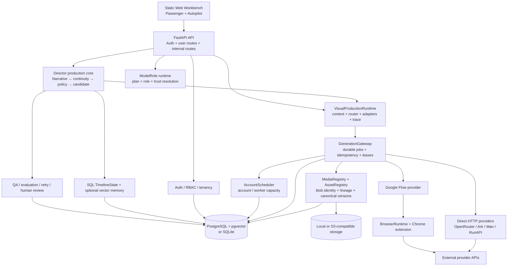

# AI Director Platform — Current Architecture

Snapshot date: 2026-08-21

Repository: `ai-director-platform`

Stable baseline: commit `d16e4ac`, tag `v0.1.0-mvp-foundation`

Current branch: `main`

Current migration-code head: `0024_workspace_credit_lifecycle`

This document describes the code that exists in the current working tree. It deliberately separates a committed,
tested MVP baseline from uncommitted post-MVP commercial provider/entitlement Phase II work. This Phase II label
is different from the numbered implementation phases in `docs/VISUAL_RUNTIME_IMPLEMENTATION.md`. The Phase II tree is not release-ready: the latest complete test
run produced `348 passed, 39 warnings`; Ruff format/lint (209 files), Mypy (117 source files), Node syntax and fresh SQLite/Alembic checks pass. The working tree is dirty and Phase II is not committed; use `git status`
for the current count because documentation work changes it.

The committed MVP and its earlier architecture-document snapshot remain available in Git at tag
`v0.1.0-mvp-foundation`; that tag already contains the Visual Runtime foundation. Detailed delivery and continuation notes are in
[`docs/DEVELOPMENT_HANDOFF_2026-08-20.md`](docs/DEVELOPMENT_HANDOFF_2026-08-20.md).

## Truth labels

| Label | Meaning |
| --- | --- |
| Stable | Present in the committed MVP baseline and covered by the baseline release gate. |
| WIP implemented | Code and usually focused tests exist, but the change is uncommitted or the integrated gate is not green. |
| Partial | A useful boundary or adapter exists, but the product path or operational loop is incomplete. |
| Mock/fixture only | No real paid provider execution has been verified. |
| Not implemented | Requirement is known, but no complete runtime path exists. |

## System shape

The product is a Python 3.12 modular monolith with a static responsive Web application, a durable background
generation worker, and a Chrome extension/browser worker for signed-in Google Flow sessions. PostgreSQL with
pgvector is the intended production database; SQLite is used for local development and most automated tests.
Media is stored through either local storage or an S3-compatible backend.



Passenger and Autopilot share `VisualProductionRuntime`, `GenerationGateway`, `MediaRegistry`, account scheduling,
storage, cost records and the workspace-credit lifecycle. There is no intended second generation engine.
`CostRecord` remains provider-cost/analytics data; `WorkspaceCreditEntry` plus append-only
`WorkspaceCreditEvent` records are the wallet source of truth.

## Repository layers

| Layer | Responsibility | Principal paths | Status |
| --- | --- | --- | --- |
| Web | Login, project selection, Passenger generation, Autopilot shots, candidate QA/commit, asset version upload | `apps/web/` | Stable, with known unwired controls |
| API | User, internal, worker, OpenAI-compatible and runtime routes | `apps/api/video_platform_api/` | Stable + Phase II WIP |
| Browser worker | Google Flow browser-context command execution | `apps/browser-worker-extension/`, `services/browser-runtime/` | Stable, no current live validation |
| Domain | SQLAlchemy entities and invariants | `packages/domain/production_domain/models.py` | Stable + migrations `0021`–`0024` WIP |
| Contracts | Generation, shot and media request schemas | `packages/contracts/platform_contracts/` | Stable + Phase II additions |
| Provider SDK | Provider contract, trust, capabilities, transport and edge policy | `packages/provider-sdk/provider_sdk/` | Stable core + Phase II WIP |
| Generation gateway | Durable job state machine, exactly-once boundaries, polling, retry and events | `services/generation-gateway/` | Stable; Phase II target validation added |
| Media service | Storage registration, content reuse, lineage, safe download and provider-media upload claims | `services/media-service/` | Stable |
| Production engine | Projects, shots, continuity artifacts and shared visual runtime | `services/production-engine/` | Stable + Phase II integration |
| Director core | Narrative, identity, continuity, policy, prompts, candidates, QA and commit | `core/` | Stable + Phase II algorithm WIP |
| Model infrastructure | Logical model definitions, role bindings, plan resolution and video capability priors | `core/model-registry/`, `core/entitlements/`, `config/model-registry/`, `config/video-models/` | WIP implemented, not consolidated |
| Providers | Flow, OpenRouter, RunAPI, Ark/Seedance, Wan, DeepSeek and honest stubs | `providers/` | Mixed; see provider matrix |
| Skills | Director, shot, cinematography, movement, composition, lighting, continuity, commercial, identity and prompt guidance | `skills/` | Stable files; not separate autonomous services |

## Product entry modes

### Passenger Seat

The user can choose image or video, enter a prompt, select a visible model option, attach a reference image,
view an estimated cost, submit a durable job, and promote a completed result into a logical asset version.

Current path:

```text
Web Passenger form
→ POST /api/passenger/generate
→ workspace/model-role resolution when a role is supplied
→ CreditPricingEngine estimate
→ VisualProductionRuntime.submit_passenger
→ GenerationGateway
→ provider
→ MediaRegistry
→ optional AssetVersion + explicit canonical promotion
```

Important current limits:

- `PassengerGenerationCommand` still exposes raw `provider` and `model` fields for compatibility, but authenticated
  scoped workspaces pass through `GenerationAdmissionService`; raw targets cannot override the server-selected role.
- Passenger, generic, OpenAI-compatible image/video and Shot Candidate entry points now use the same server-owned
  plan/deployment/pricing admission boundary. Free video resolves to `VIDEO_SEEDANCE`; Free image fails closed until
  an image role exists.
- Job creation, the server-priced Free credit reservation, `CostRecord`, trace/candidate and idempotency records
  share one transaction. Available balance is reduced by the hold; completion settles it, a proven pre-submit
  terminal outcome refunds it, and an uncertain paid boundary freezes it for reconciliation.
- Provider API keys are not passed through the current Docker Compose provider environment block.

### Autopilot

Current conceptual path:

```text
Episode script
→ NarrativeCompiler v2
→ Scene / Shot / NarrativeEvent / TimelineState
→ ContinuityDecisionEngine
→ GenerationPolicyEngine
→ CapabilityResolver / Visual model router
→ CanonicalShotSpec + VideoShotPromptCompiler
→ model-specific adapter
→ CandidatePipeline + GenerationGateway
→ QA or explicit human review
→ atomic candidate commit
→ ShotStateSnapshot + END_FRAME + next-shot state propagation
```

The deterministic algorithm core is covered at two levels. The original three-shot planning/state test deliberately
uses simulated committed state and creates zero generation jobs. A second offline Fixture E2E executes three real
Candidate/GenerationJob lifecycles through provider submit/poll, local MP4 registration, trusted synthetic QA,
commit, FFmpeg end-frame extraction, snapshots, timeline propagation and accepted `CostRecord` updates. It proves
service orchestration without network spend; it is not evidence of a live Provider or production visual reviewer.

## Authentication and tenancy

Authentication is implemented with email/password registration and login, PBKDF2-SHA256 password hashing,
hashed expiring/revocable sessions, and workspace roles `OWNER`, `ADMIN`, `EDITOR`, and `VIEWER`.

User routes resolve project ownership through the authenticated principal. Internal control-plane routes use a
separate high-entropy `PLATFORM_API_KEY`. Browser workers use scoped, revocable worker credentials and one-use
WebSocket tickets rather than the platform key.

Production startup fails closed when authentication is disabled, when the platform key is weak, or when the
credential-encryption key is absent/weak. Remaining commercial auth work includes email verification, password
reset, MFA, invitation/member management, login throttling, device-session management, security-event reporting,
and migration from browser `sessionStorage` tokens to Secure/HttpOnly cookies with CSRF protection.

## Narrative and authoritative state

`NarrativeCompiler` version `narrative-rules-v2` is a deterministic rules compiler, not an LLM wrapper. It:

- recognizes common Chinese and English scene headers;
- splits only at explicit action boundaries;
- creates or reuses project-level Character, Location and Prop rows;
- creates stable UUID5 graph nodes for actions, dialogue, relationships and narrative facts;
- writes NarrativeEvent rows with pre-state, action/effects and post-state;
- emits one primary action per Shot by default;
- refuses to recompile an episode that contains committed shots.

`TimelineState` in SQL is authoritative. `AuthoritativeTimelineStateEngine` v2 requires the source Shot to be
`COMMITTED` and allows propagation only into a `DRAFT`, `PLANNED`, or `READY` target. It copies the committed
`SHOT_OUTPUT` into the next Shot's `SHOT_INPUT`, then rebases that Shot's planned `SHOT_OUTPUT` by replaying the
deterministic structural delta from its old input to old output. Active and terminal targets are fenced before any
write; ownership/type mismatches fail closed. Scene changes, time jumps, flashbacks, montages and explicit resets
stop propagation. Autopilot persists a server-owned fence over the Shot status plus authoritative input/output
state IDs, predecessor IDs and stable payload hashes. The Gateway locks and rechecks that fence in the same
transaction that creates the Job/Candidate/CostRecord/credit hold and moves the Shot to `QUEUED`; a changed plan
therefore produces a conflict before any of those writes. The engine currently propagates one hop, and vector
memory never overwrites SQL state.

## Continuity and generation policy

`ContinuityDecisionEngine` version `continuity-rules-v2` consumes a bounded risk vector and returns
`HARD_CONTINUITY`, `HYBRID`, or `RE_ANCHOR` with reason codes and required context. Reverse shots, large camera-axis
changes, scene/time boundaries, missing/bad end frames and high identity risk force re-anchoring.

`GenerationPolicyEngine` version `generation-policy-rules-v2` maps continuity and available canonical assets into
provider-neutral policies. The policy vocabulary contains:

- `TEXT_TO_VIDEO`
- `IMAGE_TO_VIDEO`
- `CONTINUE_I2V`
- `CONTINUE_V2V`
- `REFERENCE_TO_VIDEO`
- `START_END_FRAME`
- `HYBRID_REFERENCE`
- `REANCHOR_CHARACTER`
- `REANCHOR_SCENE`
- `REANCHOR_FULL`

The current `decide()` implementation emits seven of these: `TEXT_TO_VIDEO`, `IMAGE_TO_VIDEO`,
`CONTINUE_I2V`, `REFERENCE_TO_VIDEO`, `START_END_FRAME`, `HYBRID_REFERENCE`, and `REANCHOR_FULL`.
`CONTINUE_V2V`, `REANCHOR_CHARACTER`, and `REANCHOR_SCENE` are vocabulary/capability values but are not currently
selected by that decision method.

Required inputs are fail-closed. A reverse-shot re-anchor does not inherit the previous end frame as the new start
frame. Matching a requested camera angle to a specific front/profile/three-quarter character asset is not yet
implemented.

## Prompt and Skill boundaries

There are two distinct prompt systems:

1. `ImagePromptCorrector` is user-visible, source-language preserving, auditable and reversible.
2. `VideoShotPromptCompiler` compiles an approved canonical shot specification for internal Autopilot use.

Model adapters own payload fields and model-specific wording. Skills define creative and production constraints;
they do not call providers. `PromptCompilerService` and the local Skill bodies are project code. Research sources
and license decisions are recorded in `docs/skill-research.md` and `docs/source-audit.md`.

The current Director Skill includes the hook equation and approval hierarchy. It does not implement the planned
R3 experimentation, ridge-regression update, platform metric ingestion or dynamic sample sizing.

## Model infrastructure

The current tree has two related registries that are not yet consolidated:

1. Phase II added `ModelInfrastructureService`, which persists logical `ModelDefinition` and `ModelRoleBinding` rows from
   `config/model-registry/defaults.json`. The current manifest contains 13 definitions and 30 bindings. It resolves
   by business role, plan tier, trust and criticality. Environment bootstrap only configures definitions created
   in that startup, so a restart cannot overwrite an administrator's runtime ID or `enabled/live_enabled` switch.
2. The MVP already had `ModelCapabilityRegistry`, which loads versioned video capability/cost priors from `config/video-models/*.json` and
   feeds `VideoModelRouter` and pricing.

There is also an older `ProviderCapabilityRegistry` used by `CapabilityResolver`. This creates three capability
truth sources and is a known drift risk. The intended target is one persisted logical registry plus versioned,
reviewed capability profiles. A concrete current drift is that the logical registry names Wan 2.7 while
`config/video-models/wan.json` still describes experimental Wan 3.0; runtime aliasing currently reuses those 3.0
priors for the 2.7 ID.

`ModelRoleRuntime` can resolve and execute chat, embeddings, and fact-locked prompt refinement through a
`ProviderCapabilityCatalog`, recording a `DecisionRecord` without prompt content. In live mode it re-resolves the
exact persisted definition and binding at the final synchronous transport boundary, so a preceding admin disable
or runtime-ID change wins before any call. Its execution methods currently have no real product caller; role
listing and Passenger role resolution are the only connected product surfaces.

## Provider status matrix

No real paid provider call was executed by the recorded validation work for this Phase II snapshot.

| Provider path | Implemented surface | Default state | Verified reality |
| --- | --- | --- | --- |
| Google Flow | BrowserRuntime adapter, scheduler, account/project binding tables, upload/poll/download, live gate | No worker/session; capability health `NOT_CONFIGURED` | Mock/unit only; submit and poll reuse the persisted provider-project context, but first-use affinity creation and controlled migration/audit are incomplete |
| OpenRouter | One client for chat, responses, embeddings and video; Kling aliases | Requires key; live disabled | Mock/fixture tests only; no live model listing/schema smoke |
| Ark / Seedance | Doubao chat plus Seedance async video adapter | Requires Ark key and explicit model IDs; live disabled | Mock/fixture only; raw resolver has an unconfigured-binding bug |
| Wan | OpenAI-compatible chat plus DashScope async video | Requires key, bases and model IDs; live disabled | Mock/fixture only; I2V/R2V runtime mapping is incomplete |
| RunAPI | Chat/image/video Edge adapter, typed task policy, persistent $10 budget | Disabled unless explicit Edge and live gates | Mock/fixture only; prompt-refinement identity/price are server-derived; `UNCERTAIN` has a platform-key-only audited manual reconcile, while product prompt wiring and automated billing ingestion/verification remain incomplete |
| DeepSeek | Chat capability adapter | Requires key and model ID | Adapter only; no default business-role binding |
| Voyage memory | Direct Voyage embedding client plus local deterministic fallback | Local fallback without key | Direct client is live-gated; product memory does not use the OpenRouter role binding |
| Veo official | `NotConfiguredProvider` slot | Not configured | Stub only |
| Grok official | `NotConfiguredProvider` slot | Not configured | Stub only |
| Kling direct | `NotConfiguredProvider` slot | Not configured | Direct stub; Kling via OpenRouter is separately mapped |
| Omni | `NotConfiguredProvider` slot | Not configured | Stub only |
| Runway | `NotConfiguredProvider` slot | Not configured | Stub only |

Images2, Midjourney, Doubao Seed Evolving, Qwen 3.8, GLM 5.2 and the earlier proposed DeepSeek 4 Flash execution
roles are product ideas, not current runtime integrations.

## Trust and criticality

Provider trust levels are `CANONICAL`, `PRODUCTION`, `STANDARD`, `EDGE`, and `TEST_ONLY`. Asset criticalities are
`CANONICAL`, `HERO`, `IMPORTANT`, `STANDARD`, `EDGE`, and `TEMPORARY`.

The gateway rejects provider trust below the request floor before creating a job. Asset promotion, character
identity confirmation and candidate commit re-check immutable media/provider provenance. Uploading a reference to
another Provider creates a separate `MediaProviderBinding` and does not replace its origin. Therefore wrapping or
re-uploading a RunAPI result cannot launder an Edge output into a canonical identity, asset or committed timeline.

RunAPI prompt refinement also rejects public mapping/dict task declarations. Task identity and the current fixed
estimate are server-derived; a Provider response without actual billing evidence freezes the estimate rather than
claiming it was the actual cost. An internal, platform-key-only reconcile can later settle the verified actual USD
charge or release a confirmed no-charge reservation, atomically with its usage/budget update and DecisionRecord.
For LIVE transport, the budget usage is created directly as `UNCERTAIN` in the same atomic reserve transaction
before the remote call, so a process crash cannot strand a pre-boundary `RESERVED` record; a trusted synchronous actual charge and a manual
reconcile race through one linearized transition. This does not change workspace credits and is not an automated
invoice-ingestion system. FactLock compares the
structured echo, locked literals/spans, character-count evidence and bounded English/Chinese negation polarity;
this is a deterministic lexical guard, not a general semantic-entailment model.

## Generation gateway and paid-call safety

`GenerationGateway` provides:

- project-scoped payload-hash idempotency;
- durable job and event records;
- account/worker reservation with database CAS;
- expiring submission and polling leases with fencing tokens;
- explicit `NOT_SENT`, `SENT_UNCONFIRMED` and reconciliation semantics;
- no blind retry after an uncertain paid boundary;
- polling cadence and queue fairness;
- terminal-state protection;
- idempotent account/worker capacity release.
- a persisted model-definition gate: `enabled` applies in every mode and LIVE additionally requires
  `live_enabled`; request metadata cannot override either switch.

The browser command path also uses conditional command claims bound to the winning connection. The provider-media
upload path uses a durable claim lease and an audited reconciliation API for unknown remote upload outcomes. Its
first remote upload boundary atomically changes the owning GenerationJob to `SENT_UNCONFIRMED`, closes wallet
refund/retry, and records the credit boundary in the same transaction that marks the binding `UPLOADING`.

These mechanisms have extensive automated concurrency regression coverage. `GenerationAdmissionService` now
re-resolves authenticated public intents from workspace plan and business role, performs server pricing, and asks
the Gateway to atomically create the Job, Free workspace reservation, `CostRecord`, trace/candidate and idempotency
row. Concurrent replay of the same project-scoped key reserves once; the reservation also has a unique Job
identity and immutable server quote on `GenerationJob`.

The wallet state machine is now:

```text
RESERVED --completed--> SETTLED
RESERVED --proven pre-submit terminal/cancel--> REFUNDED
RESERVED --paid result uncertain--> RECONCILIATION_REQUIRED
RECONCILIATION_REQUIRED --internal evidence decision--> SETTLED | REFUNDED
```

Crossing the paid-call boundary is persisted before Provider invocation. A Provider error cannot downgrade that
fact, and cancellation, retry, polling, restart recovery, terminalization and wallet transitions use conditional
database updates so a stale worker cannot revive a refunded/terminal Job. Unknown, failed or cancelled remote
outcomes keep the hold; they are never blindly refunded or re-submitted. The internal reconciliation route accepts
only evidence decisions (`CONFIRM_PROVIDER_ACCEPTED` or `CONFIRM_PROVIDER_NOT_CREATED`), derives the exact amount
from the original reservation, requires an idempotency key and writes both decision and lifecycle audit records.
It does not accept client-supplied credits, provider cost or wallet state.

## Media and logical assets

`MediaAsset` represents one project-scoped use/lineage of stored bytes. Storage blobs can be reused by SHA-256
without collapsing independent shot/candidate lineage. `Asset` and immutable `AssetVersion` provide logical
character, scene, product, prop, wardrobe, vehicle, creature, voice, style and reference assets.

Canonical changes require explicit `AssetCanonicalPromotion` records. Database constraints/triggers prevent
cross-asset canonical pointers, cross-asset parents, unlogged promotion and mutation/deletion of immutable version
history. A user can upload a modified character/scene/product image as a new version; old versions remain.

## QA, evaluation and commit

`QAPipeline` performs file/decode checks, seven weighted dimensions, hard reason codes and rule-based dynamic
identity evidence. Incomplete trusted evidence becomes `USER_REVIEW_REQUIRED`; it is not treated as automatic
PASS. An authenticated user with write access can approve an eligible review-required result only by supplying a
reason and explicit confirmation, producing a separate QAResult and DecisionRecord.

Current identity thresholds include a minimum of six samples by default, `minimum < 0.62` hard drift,
`average < 0.5` wrong character, and hair/costume thresholds of `0.65`. NaN, infinity, strings and out-of-range
similarities fail closed.

This is not a real visual QA stack. There is no production frame sampler, tracker, view classifier, face-identity
model or VLM judge connected. Candidate commit is concurrency-safe and writes one canonical winner, state
snapshot, continuity artifacts and accepted-cost status atomically, but only after QA/human-review state permits.
The normal worker completes a candidate with no trusted visual evidence, so the current default operational result
is generally `USER_REVIEW_REQUIRED`, followed by the explicit human-review path.

## Memory, evaluation and metrics

The stable Visual Runtime includes:

- L0/L1/L2 `ShotMemory` records;
- metadata-first retrieval and bounded context assembly;
- local deterministic embeddings and optional live-gated Voyage embeddings;
- structured `GenerationEvaluator` decisions and bounded retry planning;
- append-only model metrics, benchmark results and production traces;
- feature flags for Voyage memory, automatic evaluation, automatic retry, adaptive routing and Wan experiments.

Automatic high-risk features remain off by default. Local hash embeddings are useful for deterministic testing,
not production semantic quality or identity decisions.

## Data architecture

The current ORM defines the following table groups.

| Domain | Tables |
| --- | --- |
| Auth and tenancy | `users`, `workspaces`, `workspace_memberships`, `auth_sessions`, `legacy_workspace_claims` |
| Plan and wallet lifecycle | `workspace_credit_entries`, `workspace_credit_events`; `workspaces.plan_tier`, `workspaces.credit_balance` |
| Story hierarchy | `projects`, `episodes`, `scenes`, `shots`, `events` |
| State and continuity | `timeline_states`, `shot_state_snapshots` |
| Characters/world | `characters`, `character_identity_versions`, `locations`, `props` |
| Candidate/media | `generation_candidates`, `media_assets` |
| Logical asset registry | `assets`, `asset_versions`, `asset_version_media`, `asset_canonical_promotions` |
| Provider resources | `provider_credentials`, `provider_accounts`, `browser_workers`, `worker_access_credentials`, `worker_socket_tickets` |
| Generation | `generation_jobs`, `generation_idempotency`, `generation_events`, `worker_commands` |
| Provider affinity/media | `media_provider_bindings`, `provider_projects`, `provider_character_bindings`, `provider_instruction_bindings` |
| Quality/cost/audit | `qa_results`, `cost_records`, `decision_records` |
| Skills/prompts | `skills`, `skill_versions`, `prompt_compilations`, `prompt_revisions` |
| Runtime intelligence | `feature_flags`, `shot_memories`, `evaluation_results`, `model_metrics`, `model_benchmark_results`, `production_traces` |
| Phase II model/provider | `model_definitions`, `model_role_bindings`, `provider_budgets`, `provider_budget_usages` |

The migration-code chain is linear from `0001_platform_v1` through `0024_workspace_credit_lifecycle`. A fresh SQLite
database upgrades to head and passes `alembic check`. The two supported assetless/legacy recovery snapshots now
pass because `0023` skips a missing commercial workspace schema while failing closed on a partial dependency set.
The populated SQLite `0023 → 0024 → 0023 → 0024` round trip is covered, including legacy settlement events
and foreign keys. `0024` refuses an active Free Job that has no reservation instead of grandfathering a free paid
call. Real PostgreSQL + pgvector validation for `0021`–`0024` is still pending.

The ignored local development database `data/platform.db` is not at head. Its Alembic stamp is `0020`; its
`workspaces` table lacks `plan_tier` and `credit_balance`, while several `0021`–`0023` tables already exist because
ORM `create_all` created them. This is a mixed-schema drift state and can break the default local application path.
Back it up before any repair; do not manually stamp it or use it as migration evidence.

## API surfaces

The FastAPI application exposes these categories:

- `/api/auth/*`: register, login, logout and current user.
- `/v1/projects`, `/v1/episodes`, `/v1/scenes`, `/v1/shots`: story hierarchy.
- `/v1/shots/*/generate|validate|human-review|commit`: candidate lifecycle.
- `/v1/characters/*`: character and immutable identity confirmation.
- `/v1/assets`, `/api/assets/*`: media upload and logical asset versions.
- `/api/passenger/generate`, `/v1/generations`, `/v1/images/generations`, `/v1/videos/generations`: admitted generation entry points.
- `/api/workspaces/{workspace_id}/credits`: authenticated balance, holds, lifecycle entries and recent events.
- `/v1/accounts`, `/v1/workers/*`: provider resources and browser workers.
- `/internal/generations/{job_id}/credit-reconcile`: platform-key-only, explicit and idempotent evidence decision
  for an uncertain original reservation.
- `/internal/provider-budget-reservations/{reservation_id}/reconcile`: platform-key-only, explicit and idempotent
  billing-evidence decision for an `UNCERTAIN` Provider USD reservation.
- `/internal/*`: router, memory, evaluation, retry, metrics, benchmarks, flags, traces, worker credentials,
  legacy claim and provider-media reconciliation.

Authenticated Passenger, generic, OpenAI-compatible image/video and Shot Candidate requests all pass through
server-owned Admission. Compatibility request fields cannot override the resolved Free plan role, deployment,
trust boundary or quote. Legacy internal fallbacks fail closed for commercial workspaces when they cannot obtain a
server quote. The Web still derives one display hint from the user's workspace list, but the API never trusts that
hint for entitlement or charging.

## Web workbench

The current single-page Web UI has:

- login/register gate and logout;
- project selector and accessible native-dialog project creation;
- Passenger image/video modes, prompt correction/undo, logical model list, reference upload, job refresh and
  promote-to-asset;
- asset version upload for people, scenes, products, props, wardrobe, style and references;
- Autopilot script compilation, scene/shot timeline, candidates, quality checks, explicit human review and commit;
- character creation and identity-version upload;
- continuity explanation and hidden advanced compiled prompt;
- responsive layouts and rounded, high-contrast technology styling.

The camera scale, angle, movement and lighting controls do not enter the generation request. Angle and movement
are compressed elsewhere into a binary continuity-risk hint, while shot scale and lighting are currently unused.
`generateShot()` submits only shot ID, idempotency key and estimated cost. All four controls must be wired into a
typed, versioned shot revision flow or hidden before release.

## Deployment and security

Docker Compose defines Web, API, worker, PostgreSQL/pgvector, MinIO and bucket initialization. Compose structure
validation passes only when required internal secrets are supplied. It uses development database/object-storage
credentials and has not been built and health-tested for this Phase II snapshot.

Normal provider execution defaults to:

```env
PROVIDER_MODE=mock
ALLOW_LIVE_PROVIDER_CALLS=false
```

A live call requires all three:

```env
PROVIDER_MODE=live
ALLOW_LIVE_PROVIDER_CALLS=true
LIVE_PROVIDER_CONFIRMATION=I_UNDERSTAND_THIS_COSTS_MONEY
```

RunAPI additionally requires `ALLOW_RUNAPI_EDGE_CALLS=true`, Edge/Temporary criticality, policy approval and a
budget reservation. `tests/live/` documents the isolated contract, pytest registers `live_provider`, and
`--run-live-provider` is required before marked tests can run. Ordinary tests force mock/closed gates even when the
parent shell exports live values. There are currently no executable live tests and no recorded paid call.

## Current release posture

The committed MVP baseline is recoverable from Git. The present Phase II working tree must not be tagged or
deployed. Before further feature work, the next engineer must:

1. preserve the dirty tree and read the handoff;
2. back up and audit the mixed-schema local database; do not use it as migration evidence;
3. resolve the 50-vs-87 Seedance pricing conflict, then design grants/purchases/expiry/admin adjustments without
   weakening the completed generation reservation lifecycle;
4. connect the typed, fact-locked RunAPI refinement primitive to the product prompt path and add automated,
   independently verified Provider billing ingestion on top of the existing manual uncertain-cost reconcile;
5. close remaining Flow automatic-affinity/migration, configured semantics and Wan mode-ID inconsistencies;
6. rerun PostgreSQL migrations for `0021`–`0024` and Compose build/up/health before any release commit;
7. rotate every Provider credential exposed in conversation before any live call.
