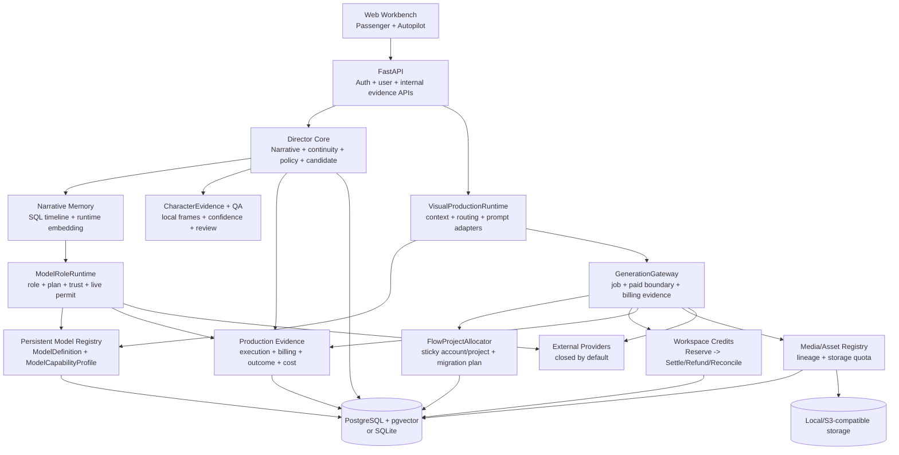

# AI Director Platform — Current Architecture

Snapshot date: 2026-08-21
Repository: `ai-director-platform`
Branch: `main`
Offline algorithm baseline: commit `0a74d31`, tag `v0.2.0-algorithm-core-offline`
Phase III implementation: commit `99f9c60`, evidence tag `v0.3.0-production-evidence-core-offline`
Migration head: `0027_production_evidence_core`
Release posture: **NOT PRODUCTION-READY**

This document describes the Phase III offline evidence checkpoint. The offline baseline was frozen after the historical
`348 passed, 39 warnings` gate. Phase III currently passes `406 passed, 57 warnings in 71.58s`, Mypy over 121
source files, Ruff lint, Ruff format (226 files), Node syntax and `git diff --check`. The warnings are principally known
Alembic/SQLite/Starlette deprecations and a SQLAlchemy foreign-key cycle warning. The checkpoint is recoverable from
Git, but it is explicitly offline evidence rather than a production release; no real Provider call was executed.

## Truth labels

| Label | Meaning |
| --- | --- |
| Frozen baseline | Present at commit `0a74d31` and recoverable from tag `v0.2.0-algorithm-core-offline` |
| Checkpoint implemented | Code and offline tests exist in the committed Phase III evidence checkpoint |
| Fixture evidence | Real local bytes/SQL/service flow were exercised with self-generated or deterministic test inputs |
| Live verified | A real external Provider call and its result/billing evidence were recorded |
| Not implemented | No complete current path exists |

There is **no Live verified Provider row in this snapshot**. Adapter, payload, Mock transport and fixture evidence
must not be relabeled as live proof.

## System shape

The product is a Python 3.12 modular monolith with a static responsive Web application, FastAPI control/data plane,
a durable generation worker and a Chrome extension/browser worker for explicitly authorized Google Flow sessions.
PostgreSQL + pgvector is the production database; SQLite remains a local/test compatibility target. Media uses
local or S3-compatible storage.



Passenger and Autopilot share `VisualProductionRuntime`, `GenerationGateway`, `MediaRegistry`, storage, routing,
provider execution and accounting. A second generation engine or wallet is not allowed.

## Repository layers

| Layer | Principal paths | Current status |
| --- | --- | --- |
| Web | `apps/web/` | WIP implemented; cookie/CSRF client path and 4-second starter default connected |
| API | `apps/api/video_platform_api/` | WIP implemented; auth/quota/canary/evidence routes added |
| Browser worker | `apps/browser-worker-extension/`, `services/browser-runtime/` | Frozen baseline; no current Flow live validation |
| Domain/contracts | `packages/domain/`, `packages/contracts/` | WIP through migrations `0025`–`0027` |
| Model infrastructure | `core/model-registry/`, `core/entitlements/`, `config/model-registry/` | Persistent single capability truth and role runtime |
| Director/QA/cost | `core/narrative/`, `core/continuity/`, `core/generation-policy/`, `core/qa/`, `core/cost/`, `core/production/` | WIP implemented with offline evidence tests |
| Generation/media | `services/generation-gateway/`, `services/media-service/`, `services/production-engine/` | Durable paid boundary, billing evidence, Flow affinity and storage quota |
| Providers | `providers/` | Mixed adapter/stub state; none live-verified in Phase III |
| Skills | `skills/` | Existing guidance retained; no broad Phase III expansion |

## Product entry modes and accounting

Passenger path:

```text
authenticated request
-> server-owned plan/role/capability resolution
-> server pricing and trust/criticality gates
-> atomic Job + credit reservation + CostRecord + idempotency
-> shared Visual Runtime and GenerationGateway
-> Provider boundary (Mock by default; live also requires a permit)
-> completion/billing evidence/media
-> settle, refund or reconcile
```

When Passenger video duration is omitted it defaults to 4 seconds. Under the current Seedance pricing snapshot this
is about 44 credits, allowing one request against the 50-credit starter grant. An explicit 8-second request remains
about 87 credits and fails before Job/Provider creation if the balance cannot be reserved. Purchases, recurring
grants, expiry and administrator adjustments are not implemented.

The workspace wallet is authoritative only for user credits:

```text
RESERVED --completed--> SETTLED
RESERVED --proven pre-submit terminal--> REFUNDED
RESERVED --paid result uncertain--> RECONCILIATION_REQUIRED
RECONCILIATION_REQUIRED --evidence decision--> SETTLED | REFUNDED
```

Workspace credits, generation supplier USD/credit evidence, Flow account credits and RunAPI's edge budget are
separate accounting domains.

## Authentication, tenancy and storage

Authentication provides email/password registration and login, PBKDF2-SHA256 password hashing, hashed durable
sessions, workspace roles and project/asset/job tenant isolation. Phase III adds:

- HttpOnly session cookies;
- `Secure` cookies in production and `SameSite=Lax`;
- double-submit CSRF for unsafe cookie-authenticated requests, while scoped Bearer/internal callers remain
  supported;
- persistent login throttles;
- expiring, hashed, one-use password-reset tokens; successful reset revokes active sessions;
- Web `credentials: include` and CSRF headers, with no session token in `sessionStorage`.

Workspace storage keeps `max_storage_bytes`, `used_storage_bytes` and `reserved_storage_bytes`. Upload admission
reserves bytes atomically; successful registration settles the reservation, proven failure releases it and an
uncertain post-registration failure keeps a hold for reconciliation. `MediaAsset.size_bytes` records actual bytes.

Email verification, MFA, member invitations/removal, device-session operations and a complete security-event
program remain production blockers.

## Narrative, timeline and committed-state safety

The deterministic Narrative Compiler still produces the SQL story graph and planned state. It does not require a
Provider call. External model reasoning is used only where a current business caller explicitly requests it
through `ModelRoleRuntime`.

`TimelineState` remains authoritative. `AuthoritativeTimelineStateEngine` v3 uses a relational
`TimelineTransition` for:

```text
CONTINUOUS, SCENE_CUT, TIME_JUMP, FLASHBACK, FLASH_FORWARD,
MONTAGE, DREAM, LOCATION_CHANGE, EXPLICIT_RESET
```

`CONTINUOUS` can propagate committed character/prop/costume state. Scene/location boundaries reset spatial state.
Time jumps, flash-forward and montage require reconciliation. Flashback/flash-forward/dream create branch keys.
Legacy string hints are converted to a row instead of remaining an alternate source of truth.

Editing an earlier committed-state input marks later shots `downstream_state_stale` with `RECOMPUTE_REQUIRED`.
Planning-only recompute stops at active/committed shots and never mutates committed media. The public committed-shot
revision experience is not claimed complete.

## Model capability and role runtime

`ModelDefinition`, `ModelRoleBinding` and the one-to-one persistent `ModelCapabilityProfile` now form the
authoritative model registry. The profile owns supported generation modes/references/frames/audio/text, duration,
aspect ratio, resolution, Provider metadata and manual quality priors. Old per-provider video capability JSON files
were removed, so UI, admission, policy, router, cost and adapters cannot read a parallel capability truth. Wan is
registered consistently as 2.7 rather than borrowing experimental 3.0 priors.

Manual priors are labeled `MANUAL_PRIOR`. Runtime observations are blended by the router with:

```text
prior_weight = 0.80
observation_weight = 0.20
minimum_sample_count = 20
```

The observation weight scales with sample coverage; a few attempts cannot replace reviewed priors.

All current business paths that actually execute external chat, embedding or fact-locked refinement use
`ModelRoleRuntime` (100% of current product model-execution callers). This does not mean every deterministic
Director algorithm was converted into an LLM call. Runtime execution:

1. resolves plan, role, model, trust and enabled state;
2. rechecks the persisted binding/model at the final live boundary;
3. requires a matching live canary permit in live mode;
4. executes the adapter;
5. persists success or failure as a `ModelExecutionRecord` with request hash, latency, token use and explicit cost
   source;
6. stores no prompt body or Provider key in the evidence record.

Narrative Memory no longer calls a Voyage client directly. It requests `MULTIMODAL_EMBEDDING` through the runtime,
writes `EmbeddingEvidence` containing input/vector hashes and dimension rather than the full vector, and degrades to
structured SQL timeline with `MEMORY_VECTOR_DEGRADED` when vector execution is unavailable.

## Provider status and Flow affinity

No provider below was called live during Phase III.

| Provider path | Implemented surface | Current truth |
| --- | --- | --- |
| Google Flow | BrowserRuntime, account scheduler, automatic project affinity, upload/submit/poll/download, migration plan | Offline only; default project provisioner fails closed; no real account/project operation |
| OpenRouter | Chat/responses/embeddings/video adapter and logical GPT/Claude/Kling roles | Offline/Mock only; no role canary |
| Ark / Seedance | Doubao-compatible chat and asynchronous Seedance video adapter | Offline/Mock only; no video canary |
| Wan 2.7 | OpenAI-compatible chat and DashScope T2V/I2V/R2V surfaces | Offline/Mock only; no live schema/job |
| RunAPI | Typed low-trust Edge tasks, fact lock, budget and benchmark record | Offline/Mock only; prompt canary not executed |
| DeepSeek | Compatible chat adapter | Adapter only; no default verified product deployment |
| Voyage | Runtime embedding role | Offline/Mock/degraded tests only; no multimodal canary |
| Veo/Grok/Kling direct/Omni/Runway | Honest not-configured slots where applicable | Not deployed |

For Google Flow, `FlowProjectAllocator` owns first-use affinity. Active-state partial unique indexes enforce:

```text
one local project -> at most one active Google Flow binding
one remote Flow project -> exactly one permanent local owner across all binding statuses
```

The selected account is sticky. Account failure does not silently round-robin to a new context; it moves the
binding toward `MIGRATION_REQUIRED`. `FlowMigrationPlan` records source/target account and project plus
character/instruction/asset transfer facts and returns `USER_REVIEW_REQUIRED` if context cannot be verified.
Polling identifies the tuple `(local_generation_job_id, provider_account_id, provider_project_id,
provider_job_id)` rather than trusting a remote job ID alone.

## Character evidence and QA

`CharacterEvidenceProducer` V1 has the following local pipeline:

```text
MP4 -> FFmpeg frame sampling -> Person/Face detector interface
-> Character tracker interface -> FaceIdentityEncoder + AppearanceEncoder
-> view-aware canonical reference selection -> confidence-weighted temporal aggregate
-> QAPipeline
```

Each sample includes face visibility, detection/track confidence, yaw, blur, selected reference, face/appearance
similarity and encoder versions. Evidence quality weights low-visibility, blurred or low-confidence samples down.
Front, three-quarter and profile views select the nearest matching canonical reference. Aggregates include average,
minimum, p10, drift slope, low-score duration, appearance and reacquisition. Thresholds are versioned by shot/view
rather than learned from the current small sample.

Tracking ambiguity emits `TRACKING_UNCERTAIN` and requires semantic/VLM review. Hair and costume remain
`UNAVAILABLE`; no weak proxy is presented as high-confidence evidence.

Evidence validation currently uses a self-generated non-user MP4 and deterministic injected detector/tracker/
encoder implementations. FFmpeg reads real video bytes, but concrete production inference models are not bundled,
deployed or calibrated. Therefore Phase III proves the producer contract and QA evidence flow, not production
identity accuracy or a real-user visual QA result.

## Production evidence and cost

Phase III introduces these durable evidence rows:

| Evidence | Purpose |
| --- | --- |
| `ModelExecutionRecord` | role/model/provider attempt, hash, latency, tokens, status and cost source |
| `EmbeddingEvidence` | asset/input/model linkage, dimension, vector hash, latency and optional cost |
| `ProviderBillingEvidence` | Provider cost/credits with `VERIFIED_PROVIDER`, `ESTIMATED`, `RECONCILED_MANUAL` or `UNKNOWN` |
| `DecisionOutcomeRecord` | shot features, continuity, generation policy, provider/model, candidate, QA, user outcome and cost |
| `RunAPIBenchmark` | edge task hash, fact-lock/fallback, latency, quality, actual cost and optional acceptance |
| `LiveCanaryPermit` / `LiveCanaryUsage` | bounded live authorization and each reserved/uncertain/settled operation |

Gateway completion parses a constrained set of Provider usage/billing fields and stores a response hash/reference,
not the raw response. When no trustworthy amount or credits exist, evidence is `UNKNOWN`, estimates remain separate
and `actual_cost` stays null. Verified or manually reconciled amounts retain their source.

Accepted-shot economics include failed candidates, the accepted candidate and repair/retry attempts. Aggregation
reports attempts, accepted count, QA/identity/camera/action pass rate, latency, failure rate, verified/estimated
totals, wasted cost and cost per accepted shot. `DecisionOutcomeRecord` is the durable future training/evaluation
join and is not casually deleted.

## Live-call safety

Default execution is offline:

```env
PROVIDER_MODE=mock
ALLOW_LIVE_PROVIDER_CALLS=false
```

A normal live call requires the existing three-part gate:

```env
PROVIDER_MODE=live
ALLOW_LIVE_PROVIDER_CALLS=true
LIVE_PROVIDER_CONFIRMATION=I_UNDERSTAND_THIS_COSTS_MONEY
```

RunAPI also requires `ALLOW_RUNAPI_EDGE_CALLS=true` and Edge/criticality/budget approval. Phase III adds a mandatory
durable `LiveCanaryPermit` at both `ModelRoleRuntime` and media-generation boundaries. A permit binds Provider and
model, expiry, purpose, maximum request count and maximum USD cost. Reservation is idempotent; the remote boundary
is marked uncertain before network work; proven pre-boundary failure may release; a trusted actual amount settles;
request or cost exhaustion hard-stops.

`POST /internal/live-canary-permits` requires `PLATFORM_API_KEY`, explicit confirmation and an idempotency key. It
only creates authorization and audit data; it never executes a Provider. No canary permit was used for a real call
in this phase.

Actual Phase III canary status:

```text
RunAPI edge:        NOT EXECUTED
OpenRouter role:    NOT EXECUTED
Voyage embedding:  NOT EXECUTED
Flow low-cost:      NOT EXECUTED
Single video shot: NOT EXECUTED
Known spend:        USD 0
```

## Data architecture and migrations

Phase III extends the existing table groups with:

| Domain | Tables/columns |
| --- | --- |
| Flow affinity | enriched `provider_projects`, `flow_migration_plans`, `generation_jobs.provider_project_id` |
| Capability | `model_capability_profiles` |
| Execution/evidence | `model_execution_records`, `embedding_evidence`, `provider_billing_evidence`, `decision_outcome_records`, `runapi_benchmarks` |
| Timeline | `timeline_transitions`; Shot stale/recompute columns |
| Canary | `live_canary_permits`, `live_canary_usages` |
| Auth | `password_reset_tokens`, `auth_login_throttles`; credential status/fingerprint fields |
| Storage | workspace max/used/reserved bytes, `storage_reservations`, `media_assets.size_bytes` |

The migration chain is single-head through:

```text
0024_workspace_credit_lifecycle
-> 0025_flow_project_affinity
-> 0026_model_capability_registry
-> 0027_production_evidence_core
```

PostgreSQL 17.10 + pgvector 0.8.6 was validated on temporary databases for fresh and populated paths, supported
round trips, `vector(16)`, indexes/unique constraints/foreign keys, credit reservation transactions, generation
enqueue transactions and current head `0027`. SQLite migration and assetless historical guards remain in the
offline suite. The ignored `data/platform.db` is not used as production migration evidence and must not be blindly
stamped or upgraded.

## Internal observability

`GET /internal/production-evidence` is protected by `PLATFORM_API_KEY` and requires an exact `project_id`, with
optional job/shot filters. It returns redacted model executions, Provider jobs, Provider billing evidence,
CostRecords, Flow bindings, QA evidence, decision outcomes, timeline transitions and stale state. Provider
references are fingerprinted; prompt bodies, vectors, raw Provider responses and credentials are not returned.

`POST/GET /internal/live-canary-permits` creates explicitly confirmed, idempotent permits and lists permit/usage
state. These are development/operator APIs, not a redesigned analytics dashboard.

## Deployment evidence

Docker Desktop 29.5.3 was used for an offline production-like smoke with development-only fake credentials:

- `docker compose config -q` passed;
- API, worker and Web images built;
- Compose started successfully;
- PostgreSQL, MinIO and API reported healthy; Web and worker stayed Up;
- MinIO initialization exited 0 and created the bucket;
- host checks returned HTTP 200 for API `/health`, Web `/` and MinIO live health;
- in-container Alembic `current` was head `0027`, `alembic check` found no schema drift except the known FK-cycle
  warning, and pgvector reported 0.8.6;
- no Provider key was supplied and no live Provider call was possible.

The stack is shut down after the smoke without deleting volumes. This is local deployment evidence, not evidence
for managed secrets, HTTPS, backups, external observability or a public production environment.

## Current release posture

The Phase III checkpoint is not ready for production despite offline, PostgreSQL and Docker gates passing. Remaining
blockers include:

1. deploy and calibrate concrete character detection/tracking/face/appearance inference and a trusted uncertain-
   evidence review path;
2. execute separately authorized Provider canaries and collect real billing/credit evidence;
3. keep the single paid video canary at **NOT EXECUTED** until a precise bounded permit is intentionally created;
4. complete email verification, MFA/invitations/device sessions, production HTTPS/secrets, backup/restore,
   monitoring/alerts and operations policy;
5. implement purchases/grant lifecycle/expiry/admin adjustments before claiming a complete commercial wallet.

Credential values remain outside the repository. The operator explicitly decided that the current Provider keys
do not require rotation. This decision removes rotation as a blocking action but does not authorize committing,
logging, exposing or automatically using those keys.
